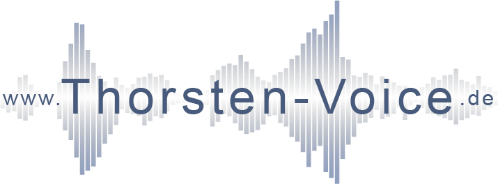

- [Project motivation](#motivation-for-thorsten-voice-project-speaking_head-speech_balloon)
  
- [Personal note](#some-personal-words-before-using-thorsten-voice)

- [**Thorsten** Voice Datasets](#voice-datasets)
  - [Thorsten-Voice Dataset 2021.02 (Neutral)](#thorsten-voice-dataset-202102-neutral)
  - [Thorsten-Voice Dataset 2021.06 (Emotional)](#thorsten-voice-dataset-202106-emotional)
  - [Thorsten-Voice Dataset 2022.10 (Neutral)](#thorsten-voice-dataset-202210-neutral)
  - [Thorsten-Voice Dataset 2023.09 (Hessisch)](#thorsten-voice-dataset-202309-hessisch)

- [**Thorsten** TTS-Models](#tts-models)
  
- [Public talks](#public-talks)

- [My Youtube channel](#youtube-channel)


# Motivation for Thorsten-Voice project :speaking_head: :speech_balloon:
A **free** to use, **offline** working, **high quality** **german** **TTS** voice should be available for every project without any license struggling.

# Personal words by Thorsten Müller
> I contribute my voice as a person believing in a world where all people are equal. No matter of gender, sexual orientation, religion, skin color and geocoordinates of birth location. A global world where everybody is warmly welcome on any place on this planet and open and free knowledge and education is available to everyone. :earth_africa: (*Thorsten Müller*)

Please keep in mind, that **i am no professional voice talent**. I'm just a normal guy sharing his voice with the world.

# Social media
[](https://www.youtube.com/c/ThorstenMueller)
<a href="https://twitter.com/intent/follow?screen_name=ThorstenVoice"></a>
[](https://www.Thorsten-Voice.de)

Feel free to contact me on social media 🤗.

| Platform         | Link                                                                                                            |
| --------------- | ------- |
| Youtube | [ThorstenVoice on Youtube](https://www.youtube.com/c/ThorstenMueller) |
| LinkedIn | [Thorsten Müller on LinkedIn](https://www.linkedin.com/in/thorsten-m%C3%BCller-848a344/) |
| Twitter | [ThorstenVoice on Twitter](https://twitter.com/ThorstenVoice) |
| Huggingface | [ThorstenVoice on Huggingface](https://huggingface.co/Thorsten-Voice) |
| Instagram | [ThorstenVoice on Instagram](https://www.instagram.com/thorsten_voice/) |


# Voice-Datasets
All my "Thorsten-Voice" datasets are listed and downloadable on Zenodo. Qoutation is highly appreciated in case you use them in your projects, products or papers.
| Dataset         | DOI Link                                                                                                            |
| --------------- | ------- |
| Thorsten-Voice Dataset 2021.02 (Neutral) | [](https://doi.org/10.5281/zenodo.5525342) |
| Thorsten-Voice Dataset 2021.06 (Emotional) | [](https://doi.org/10.5281/zenodo.5525023) |
| Thorsten-Voice Dataset 2022.10 (Neutral) | [](https://doi.org/10.5281/zenodo.7265581) |
| Thorsten-Voice Dataset 2023.09 (Hessisch) | [](https://doi.org/10.5281/zenodo.10511260) |

## Thorsten-Voice Dataset 2021.02 (Neutral)
[](https://doi.org/10.5281/zenodo.5525342)

```
@dataset{muller_2021_5525342,
  author       = {Müller, Thorsten and
                  Kreutz, Dominik},
  title        = {Thorsten-Voice Dataset 2021.02},
  month        = sep,
  year         = 2021,
  note         = {{Please use it to make the world a better place for 
                   whole humankind.}},
  publisher    = {Zenodo},
  version      = {3.0},
  doi          = {10.5281/zenodo.5525342},
  url          = {https://doi.org/10.5281/zenodo.5525342}
}
```

### Dataset summary
* Recorded by Thorsten Müller
* Optimized by Dominik Kreutz
* LJSpeech file and directory structure
* 22.668 recorded phrases (*wav files*)
* More than 23 hours of pure audio
* Samplerate 22.050Hz
* Mono
* Normalized to -24dB
* Phrase length (min/avg/max): 2 / 52 / 180 chars
* No silence at beginning/ending
* Avg spoken chars per second: 14
* Sentences with question mark: 2.780
* Sentences with exclamation mark: 1.840

### Dataset evolution
As described in the PDF document ([evolution of thorsten dataset](./EvolutionOfThorstenDataset.pdf)) this dataset consists of three recording phases.

* **Phase 1**: Recorded with a cheap usb microphone (*low quality*)
* **Phase 2**: Recorded with a good microphone (*good quality*)
* **Phase 3**: Recorded with same good microphone but longer phrases (> 100 chars) (*good quality*)

If you want to use a dataset subset you can see which files belong to which recording phase in [recording quality](./RecordingQuality.csv) csv file.


## Thorsten-Voice Dataset 2021.06 (Emotional)
[](https://doi.org/10.5281/zenodo.5525023)

```
@dataset{muller_2021_5525023,
  author       = {Müller, Thorsten and
                  Kreutz, Dominik},
  title        = {Thorsten-Voice Dataset 2021.06 emotional},
  month        = sep,
  year         = 2021,
  note         = {{Please use it to make the world a better place for 
                   whole humankind.}},
  publisher    = {Zenodo},
  version      = {2.0},
  doi          = {10.5281/zenodo.5525023},
  url          = {https://doi.org/10.5281/zenodo.5525023}
}
```

All emotional recordings where recorded by myself and i tried to feel and pronounce that emotion even if the phrase context does not match that emotion. Example: I pronounced the sleepy recordings in the tone i have shortly before falling asleep.

### Dataset summary
* Recorded by Thorsten Müller
* Optimized by Dominik Kreutz
* 300 sentences * 8 emotions = 2.400 recordings
* Mono
* Samplerate 22.050Hz
* Normalized to -24dB
* No silence at beginning/ending
* Sentence length: 59 - 148 chars


## Thorsten-Voice Dataset 2022.10 (Neutral)
[](https://doi.org/10.5281/zenodo.7265581)
> :speaking_head: **Listen to some audio recordings from this dataset [here](https://drive.google.com/drive/folders/1dxoSo8Ktmh-5E0rSVqkq_Jm1r4sFnwJM?usp=sharing).**

```
@dataset{muller_2022_7265581,
  author       = {Müller, Thorsten and
                  Kreutz, Dominik},
  title        = {Thorsten-Voice Dataset 2022.10},
  month        = nov,
  year         = 2022,
  publisher    = {Zenodo},
  version      = {1.0},
  doi          = {10.5281/zenodo.7265581},
  url          = {https://doi.org/10.5281/zenodo.7265581}
}
```

## Thorsten-Voice Dataset 2023.09 (Hessisch)
[](https://doi.org/10.5281/zenodo.10511260)

```
@dataset{muller_2024_10511260,
  author       = {Müller, Thorsten and
                  Kreutz, Dominik},
  title        = {Thorsten-Voice Dataset 2023.09 Hessisch},
  month        = jan,
  year         = 2024,
  publisher    = {Zenodo},
  doi          = {10.5281/zenodo.10511260},
  url          = {https://doi.org/10.5281/zenodo.10511260}
}
```

# TTS Models
Based on these opensource voice datasets several TTS (text to speech) models have been trained using AI / machine learning technology.

There are multiple german models available trained and used by by the projects [**Coqui AI**](https://github.com/coqui-ai/TTS/), [**Piper TTS**](https://github.com/rhasspy/piper) and [**Home Assistant**](https://www.home-assistant.io/). You can find more information on how to use them, audio samples and video tutorials on the [Thorsten-Voice project website](https://www.Thorsten-Voice.de).

Listen to audio samples and installation / usage instructions here (🇩🇪):
* [Neutral TTS](https://www.thorsten-voice.de/kostenloses-deutsches-text-to-speech-tts/)
* [Emotional TTS](https://www.thorsten-voice.de/emotionales-tts/)
* [Hessisches TTS](https://www.thorsten-voice.de/guude/)
* [Smarthome / Home Assistant](https://www.thorsten-voice.de/home-assistant-thorsten-voice/)

In addition Silero, Monatis and ZDisket used my voice datasets for model training too. More samples and details can be found on [Silero Thorsten-Voice audio samples](https://drive.google.com/drive/folders/1tR6w4kgRS2JJ1TWZhwoFuU04Xkgo6YAs?usp=sharing). See this [colab notebook](https://colab.research.google.com/github/snakers4/silero-models/blob/master/examples_tts.ipynb) for more details.

[ZDisket](https://github.com/ZDisket/TensorVox) made a tool called TensorVox for setting up an TTS environment on Windows and included a german TTS model trained by [monatis](https://github.com/monatis/german-tts). Thanks for sharing that. See it in action on [Youtube](https://youtu.be/tY6_xZnkv-A).

# Support & Thanks
If you like my voice contribution and would like to support my effort for an opensource voice technology future, you can support me, if you like:

* Subscribe and share my [https://youtube.com/@ThorstenMueller/](Thorsten-Voice) youtube channel and follow me on my social media profiles
* Buy me a tea using [Ko-Fi](https://ko-fi.com/thorstenvoice) or [Github sponsor](https://github.com/sponsors/thorstenMueller)

I want to say thank you to great people who supported me on this journey with nice words, support and compute power:
Thanks [El-Tocino](https://github.com/el-tocino/), [Eren Gölge](https://github.com/erogol/), [Gras64](https://github.com/gras64/), [Kris Gesling](https://github.com/krisgesling/), [Nmstoker](https://github.com/nmstoker), [Othiele](https://discourse.mozilla.org/u/othiele/summary), [Repodiac](https://github.com/repodiac), [SanjaESC](https://github.com/SanjaESC), [Synesthesiam](https://github.com/synesthesiam/).

Special thanks to my dear colleague, Sebastian Kraus, for supporting me with audio recording equipment and for being the creative mastermind behind the logo design and of course to the dear **Dominik** ([@domcross](https://github.com/domcross/)) for him being so close by my side on this amazing journey.


# Public talks
I really like to talk about the importance of an opensource voice technology future. If you would like me to be a speaker on a conference or event i'd happy to be contacted using the Thorsten-Voice [website contact form](https://www.thorsten-voice.de/en/contact/). See some of my speaker references on [Thorsten-Voice website](https://www.thorsten-voice.de/en/speaker-public-talks/).

# "Thorsten-Voice" Youtube channel
In summer 2021 i've started to share my lessons learned and experiences on open voice tech, in special **TTS** on my little [Youtube channel](https://www.youtube.com/c/ThorstenMueller). If you check out and like my videos i'd happy to welcome you as subscriber and member of my little Youtube community.
