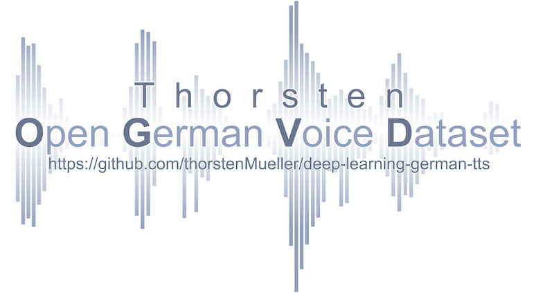

- [Introduction to "Thorsten-Voice" :speaking_head: :speech_balloon: :sloth:](#introduction-to-thorsten-voice-speaking_head-speech_balloon-sloth)
  - [**A free to use, offline working, high quality german TTS voice should be available for every project without any license struggling.**](#a-free-to-use-offline-working-high-quality-german-tts-voice-should-be-available-for-every-project-without-any-license-struggling)
  - [True, but what is this all about](#true-but-what-is-this-all-about)
- [Please read some personal words before using dataset / TTS models](#please-read-some-personal-words-before-using-dataset--tts-models)
  - [Dataset "Thorsten"](#dataset-thorsten)
    - [Samples of my voice](#samples-of-my-voice)
    - [Dataset information :microphone:](#dataset-information-microphone)
    - [Dataset evolution](#dataset-evolution)
    - [Download information](#download-information)
  - [Pretrained TTS models](#pretrained-tts-models)
    - [Trained models](#trained-models)
    - [Pre-trained Silero-models](#pre-trained-silero-models)
- [Feel free to file an issue if you ...](#feel-free-to-file-an-issue-if-you-)
- [Recommended projects / communities](#recommended-projects--communities)
- [Special thanks](#special-thanks)
- [Additional links](#additional-links)

# Introduction to "Thorsten-Voice" :speaking_head: :speech_balloon: :sloth:
## **A free to use, offline working, high quality german TTS voice should be available for every project without any license struggling.**

Speaking tech devices and voice based smart assistants are very popular ourdays. But for providing nice sounding TTS lot of projects depend on big tech cloud services for synthezing voice. While quality is quite good, there remain critical aspects like **privacy concerns** and **missing offline availablitiy**.

## True, but what is this all about
> I want to (*hopefully*) fill that german TTS gap and make the most personal contribution i can give. 
**I contribute my personal voice!** :green_heart:

This contribution is split into two parts:
* "Thorsten" dataset
* Pretrained TTS models based on "Thorsten" dataset

# Please read some personal words before using dataset / TTS models
> I contribute my voice as a person believing in a world where all people are equal. No matter of gender, sexual orientation, religion, skin color and geocoordinates of birth location. A global world where everybody is warmly welcome on any place on this planet and open and free knowledge and education is available to everyone. :earth_africa:

**So hopefully my voice is used in this manner to make this world a better place for all of us :smiley:.**

**tl;dr** Please don't use for evil!

## Dataset "Thorsten"
> Please keep in mind that **i am no professional voice artists**. I'm just a normal guy sharing his voice with you.
### Samples of my voice
To get an impression what my voice sounds to decide if it fits to your project i published some sample recordings, so no need to download complete dataset first.

* [Das Teilen eines Benutzerkontos ist strengstens untersagt.](./samples/original_recording/recorded_sample_01.wav )
* [Der Prophet spricht stets in Gleichnissen.](./samples/original_recording/recorded_sample_02.wav )
* [Bitte schmeißt euren Müll nicht einfach in die Walachei.](./samples/original_recording/recorded_sample_03.wav )
* [So etwas würde mir nie in den Sinn kommen.](./samples/original_recording/recorded_sample_04.wav )
* [Sie klettert auf einen Stein und nimmt eine Denkerpose ein.](./samples/original_recording/recorded_sample_05.wav )
* [Jede gute Küchenwaage hat eine Tara-Funktion.](./samples/original_recording/recorded_sample_06.wav )
* [Jeden Gedanken kannst du hier loswerden.](./samples/original_recording/recorded_sample_07.wav )

### Dataset information :microphone:

* ljspeech-1.1 structure
* 22.668 recorded phrases (wav files)
* more than 23 hours of pure audio
* samplerate 22.050Hz
* mono
* normalized to -24dB
* phrase length (min/avg/max): 2 / 52 / 180 chars
* no silence at beginning/ending
* avg spoken chars per second: 14
* sentences with question mark: 2.780
* sentences with exclamation mark: 1.840

### Dataset evolution
As described in the pdf document ([evolution of thorsten dataset](./EvolutionOfThorstenDataset.pdf)) this dataset consists of three recording phases.

* **phase1**: Recorded with a cheap usb microphone
* **phase2**: Recorded with a good microphone
* **phase3**: Recorded with same good microphone but longer phrases (> 100 chars)

If you wanna use just a dataset subset (phase1 and/or phase2 and/or phase3) you can see which files belong to which recording phase in [recording quality](./RecordingQuality.csv) csv file.

### Download information
> Download size: 2,7GB

| Version         | Description                                                                                       | Date       | Link                                                                                                            |
| --------------- | ------------------------------------------------------------------------------------------------- | ---------- | --------------------------------------------------------------------------------------------------------------- |
| thorsten-de-v01 | Initial version                                                                                   | 2020-06-28 | [Google Drive Download v01](https://drive.google.com/file/d/1yKJM1LAOQpRVojKunD9r8WN_p5KzBxjc/view?usp=sharing) |
| thorsten-de-v02 | Normalized to -24dB and split metadata.csv into shuffeled metadata_train.csv and metadata_val.csv | 2020-08-22 | [Google Drive Download v02](https://drive.google.com/file/d/1mGWfG0s2V2TEg-AI2m85tze1m4pyeM7b/view?usp=sharing) |
| thorsten-de-v03 | Based on v02 dataset, but with increased speed by 10% (using ffmpeg atempo=1.1).                  | 2021-02-10 | [Google Drive Download v03](https://drive.google.com/file/d/134_UramfCRoAxRrOnhbPJ2YHHTwxRtr-/view?usp=sharing) |

## Pretrained TTS models
If you trained a model on "Thorsten" dataset please file an issue with some information on it. Sharing a trained model is highly appreciated.

My personal training sessions are based on TTS repo code (originally initiated by Mozilla) and now maintained through https://www.coqui.ai (:frog:)

### Trained models
> training in progress. Available models will be listed here in future.

### Pre-trained Silero-models

You can use a free A-GPL licensed models trained on this dataset via the [silero-models](https://github.com/snakers4/silero-models) project. The full list of models including their older version is available via this [yaml file](https://github.com/snakers4/silero-models/blob/master/models.yml).

| Speaker        | Gender | Language | Examples                                                                                                                                                                                     | Colab                                                                                                                                                                        |
| -------------- | ------ | -------- | -------------------------------------------------------------------------------------------------------------------------------------------------------------------------------------------- | ---------------------------------------------------------------------------------------------------------------------------------------------------------------------------- |
| thorsten_8khz  | m      | de       | [8000](https://drive.google.com/drive/folders/1mpQCK5E_IqhcSurnYuGePJiJWL4ZL08z?usp=sharing) / [16000](https://drive.google.com/drive/folders/1tR6w4kgRS2JJ1TWZhwoFuU04Xkgo6YAs?usp=sharing) |  |
| thorsten_16khz | m      | de       | [8000](https://drive.google.com/drive/folders/1mpQCK5E_IqhcSurnYuGePJiJWL4ZL08z?usp=sharing) / [16000](https://drive.google.com/drive/folders/1tR6w4kgRS2JJ1TWZhwoFuU04Xkgo6YAs?usp=sharing) |  |

# Feel free to file an issue if you ...
* have improvements on dataset
* use my TTS voice in your project(s)
* want to share your trained "Thorsten" model
* get to know about any abuse usage of my voice

# Recommended projects / communities
* https://mycroft.ai/ (*for building an opensource privacy friendly voice assistant*)
* https://www.mozilla.org (*for initiating voice projects for STT and TTS*)
* https://coqui.ai/ (*for keeping voice projects running*)
* https://github.com/coqui-ai/TTS
* https://github.com/TensorSpeech/TensorFlowTTS
* https://github.com/rhasspy/de_larynx-thorsten

# Special thanks
I want to thank all open source communities for providing great projects.

Just to name some nice guys who joined me on this TTS roadtrip:

* eltocino (https://github.com/el-tocino/)
* erogol (https://github.com/erogol/)
* gras64 (https://github.com/gras64/)
* krisgesling (https://github.com/krisgesling/)
* nmstoker (https://github.com/nmstoker)
* othiele (https://discourse.mozilla.org/u/othiele/summary)
* repodiac (https://github.com/repodiac)
* SanjaESC (https://github.com/SanjaESC)

Additionally, a really nice thanks for my dear colleague, Sebastian Kraus, for supporting me with audio recording equipment and for being the creative mastermind behind the logo design.

And last but not least i want to say a huge thank you to a special guy who supported me on this journey right from the beginning. Not just with nice words, but with his time, audio optimization knowhow and finally his gpu computing power. 

Without his amazing support this dataset (in it's current way) would not exists.

Thank you Dominik (@domcross / https://github.com/domcross/)

# Additional links
* https://medium.com/@thorsten_Mueller/why-ive-chosen-to-donate-my-german-voice-for-mankind-177beeb91675
* https://discourse.mozilla.org/t/contributing-my-german-voice-for-tts/48150
* https://community.mycroft.ai/
* https://github.com/MycroftAI/mimic-recording-studio

We'll hear us in future :speaking_head:

Thorsten
