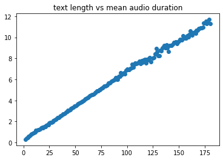
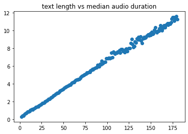
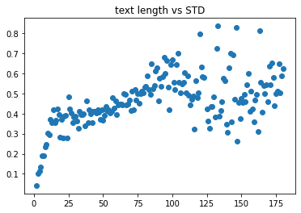
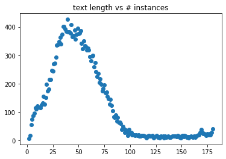
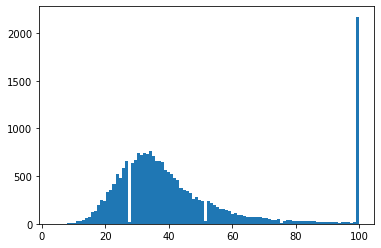
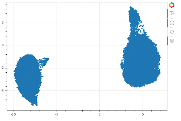

# Introduction
Many smart voice assistants like Amazon Alexa, Google Home, Apple Siri and Microsoft Cortana use cloud services to offer their (base) functionality.

As some people have privacy concerns using these services there are some (open source) projects trying to build offline and/or privacy aware alternatives.

But speech recognition and text synthesis still requires cloud services for providing these in a decent quality.

# MyCroft AI
> https://mycroft.ai/

MyCroft is a company developing an opensource voice assistant with a very nice and active community. But the stt/tts parts are still cloud based (eg. google services), even if requests are anonymized by a mycroft proxy in between. But integration with locally hosted services such as deepspeech (stt) or mimic/tacotron (tts) is possible.

# Mozilla
Mozilla works on these really important aspects for free and open human machine voice interaction.

## STT - speech to text
> https://commonvoice.mozilla.org/

"STT" needs lots of audio training data by many speakers (women/men/kids) of all ages, dialects and in various audio quality levels. So any voice contribution for common voice project is highly welcome.

## TTS - text to speech
> https://github.com/mozilla/tts

"TTS" needs lots of clean recordings by one speaker to train a model. Mozilla is developing a software stack for proper model training based on tacotron2 papers.

# And?!
I want to make the most personal contribution i can give and contribute my personal voice (**german**) for TTS training to the community for free usage.

## Please read some personal words before downloading the dataset
I contribute my voice as a person believing in a world where all people are equal. No matter of gender, sexual orientation, religion, skin color and geocoordinates of birth location. A global world where everybody is warmly welcome on any place on this planet and open and free knowledge and education is available to everyone.

So hopefully my voice is used in this manner to make this world a better place for all of us :-).

**tl;dr** Please don't use for evil!

# Dataset "thorsten"
## Samples of my voice
To get an impression what my voice sounds to decide if it fits to your project i published some sample recordings, so no need to download complete dataset first.

* [Das Teilen eines Benutzerkontos ist strengstens untersagt.](./samples/original_recording/recorded_sample_01.wav )
* [Der Prophet spricht stets in Gleichnissen.](./samples/original_recording/recorded_sample_02.wav )
* [Bitte schmeißt euren Müll nicht einfach in die Walachei.](./samples/original_recording/recorded_sample_03.wav )
* [So etwas würde mir nie in den Sinn kommen.](./samples/original_recording/recorded_sample_04.wav )
* [Sie klettert auf einen Stein und nimmt eine Denkerpose ein.](./samples/original_recording/recorded_sample_05.wav )
* [Jede gute Küchenwaage hat eine Tara-Funktion.](./samples/original_recording/recorded_sample_06.wav )
* [Jeden Gedanken kannst du hier loswerden.](./samples/original_recording/recorded_sample_07.wav )

## Dataset information

* ljspeech-1.1 structure
* 22.668 recorded phrases (wav files)
* more than 23 hours of pure audio
* samplerate 22.050Hz
* mono
* normalized to -24dB
* phrase length (min/avg/max): 2 / 52 / 180 chars
* no silence at beginning/ending
* avg spoken chars per second: 14
* sentences with question mark: 2.780
* sentences with exclamation mark: 1.840

> Interested in evolution of this dataset? See following pdf document ([evolution of thorsten dataset](./EvolutionOfThorstenDataset.pdf) )

## Download information
> Download size: 2,7GB

Version | Description | Date | Link
------------ | ------------- | ------------- | -------------
thorsten-de-v01 | Initial version | 2020-06-28 | [Google Drive Download v01](https://drive.google.com/file/d/1yKJM1LAOQpRVojKunD9r8WN_p5KzBxjc/view?usp=sharing)
thorsten-de-v02 | normalized to -24dB and split metadata.csv into shuffeled metadata_train.csv and metadata_val.csv | 2020-08-22 | [Google Drive Download v02](https://drive.google.com/file/d/1mGWfG0s2V2TEg-AI2m85tze1m4pyeM7b/view?usp=sharing)

# Trained tacotron2 model "thorsten"
If you trained a model on "thorsten" dataset please file an issue with some information on it. Sharing a trained model is highly appreciated. 

## Trained models (TODO)

Folder | Date | Link | Description
------------ | ------------- | ------------- | -------------
thorsten-taco2-ddc-v0.1 | to do | to do | to do

# Feel free to file an issue if you ...
* have improvements on dataset
* use my TTS voice in your project(s)
* want to share your trained "thorsten" model
* get to know about any abuse usage of my voice

# Special thanks
I want to thank all open source communities for providing great projects.

Just to name some nice guys who joined me on this tts-roadtrip:

* eltocino (https://github.com/el-tocino/)
* erogol (https://github.com/erogol/)
* gras64 (https://github.com/gras64/)
* krisgesling (https://github.com/krisgesling/)
* nmstoker (https://github.com/nmstoker)
* othiele (https://discourse.mozilla.org/u/othiele/summary)
* repodiac (https://github.com/repodiac)

And last but not least i want to say a huge thank you to a special guy who supported me on this journey right from the beginning. Not just with nice words, but with his time, audio optimization knowhow and finally his gpu computing power. 

Without his amazing support this dataset (in it's current way) would not exists.

Thank you Dominik (@domcross / https://github.com/domcross/)

# Links
* https://discourse.mozilla.org/t/contributing-my-german-voice-for-tts/48150
* https://community.mycroft.ai/
* https://github.com/MycroftAI/mimic-recording-studio
* https://voice.mozilla.org/
* https://github.com/mozilla/TTS
(https://github.com/repodiac/tit-for-tat/tree/master/thorsten-TTS)
* https://raw.githubusercontent.com/mozilla/voice-web/master/server/data/de/sentence-collector.txt

We'll hear us in future :-)

Thorsten
